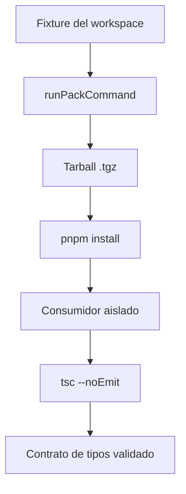

```mermaid
flowchart TD
    A["Fixture del workspace"] --> B["runPackCommand"]
    B --> C["Tarball .tgz"]
    C --> D["pnpm install"]
    D --> E["Consumidor aislado"]
    E --> F["tsc --noEmit"]
    F --> G["Contrato de tipos validado"]
```
